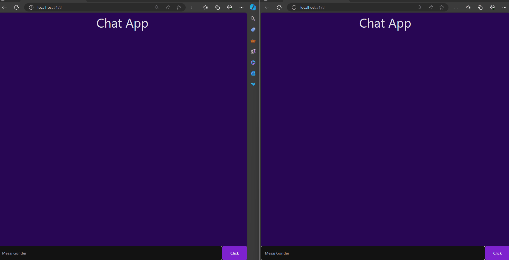

# Real Time Chat Application

This project contains a real time chat application developed using Redis, Node.js,React, and Tailwind CSS.

## Screenshot

## Features

- Users can communicate with each other in real time.
- Chat data is stored using Redis database.

## Usage

1. Clone the project files to your computer.
2. Install the necessary dependencies by running the `npm install` command in your terminal.
3. Start the Redis server.
4. Start the Node.js server by running the `npm start` command in your terminal.
5. Visit `localhost:3000` in your browser.

## Contributing

Contributions are welcome! Please contribute by creating a pull request.

